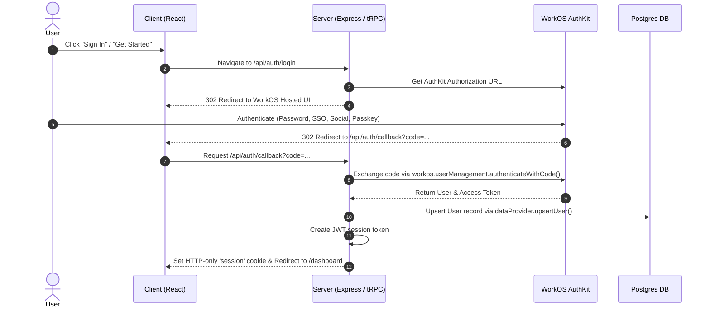

# Design Specification: WorkOS AuthKit Integration

## Overview
FinesseOS Dashboard is transitioning its authentication provider to **WorkOS AuthKit** using the WorkOS Node SDK (`@workos-inc/node`) on the backend and WorkOS Hosted AuthKit UI for client sign-in/sign-up.

## Architecture & Data Flow

## Detailed Component Specifications

### 1. Environment Configuration (`server/_core/providers/config.ts`)
- Add WorkOS credentials validation to `validateConfig()`:
  - `WORKOS_CLIENT_ID`
  - `WORKOS_API_KEY`
  - `WORKOS_REDIRECT_URI` (Default: `http://localhost:5000/api/auth/callback`)

### 2. WorkOS Auth Provider (`server/_core/providers/workosAuth.ts`)
Implement `WorkOSAuthProvider` fulfilling `IAuthProvider`:
- **`authenticate(req: Request)`**: Extracts session token from cookie/bearer header, verifies JWT, and resolves user from DB.
- **`createSession(userId: string, name?: string)`**: Signs a secure JWT containing `userId` and `name`.
- **`verifySession(token: string)`**: Verifies JWT signature and returns `{ userId, name }`.
- **`handleCallback(code: string, state: string)`**:
  1. Calls `workos.userManagement.authenticateWithCode({ code, clientId })`.
  2. Extracts user details (`id`, `email`, `firstName`, `lastName`).
  3. Upserts user into Postgres via `dataProvider.upsertUser({ openId: user.id, name, email })`.
  4. Returns user payload `{ openId, name, email }`.

### 3. Provider Factory (`server/_core/providers/index.ts`)
Update `getAuthProvider()` to select `WorkOSAuthProvider` when `WORKOS_API_KEY` and `WORKOS_CLIENT_ID` are configured, with `LocalAuthProvider` as fallback.

### 4. Auth Express Endpoints (`server/_core/index.ts`)
- `GET /api/auth/login`: Redirects browser to WorkOS AuthKit authorization URL.
- `GET /api/auth/callback`: Handles OAuth redirect code, exchanges code, provisions user, sets secure session cookie, and redirects to `/dashboard`.
- `POST /api/auth/logout`: Clears session cookie.

### 5. Frontend & Navigation (`client/src/...`)
- Update `getLoginUrl()` in `client/src/const.ts` to `/api/auth/login`.
- Update Landing Page CTA buttons to direct users to `/api/auth/login`.
- Ensure auth gate on `/dashboard` checks session status cleanly.

## Verification Plan
1. **Automated Tests**:
   - Run existing Vitest test suite (`pnpm test`) to ensure no regressions.
2. **Manual Verification**:
   - Verify `/api/auth/login` redirects to WorkOS hosted auth page.
   - Test sign-in flow with test credentials and verify redirect back to `/dashboard`.
   - Verify session cookie is set correctly and user record is persisted in Postgres.
